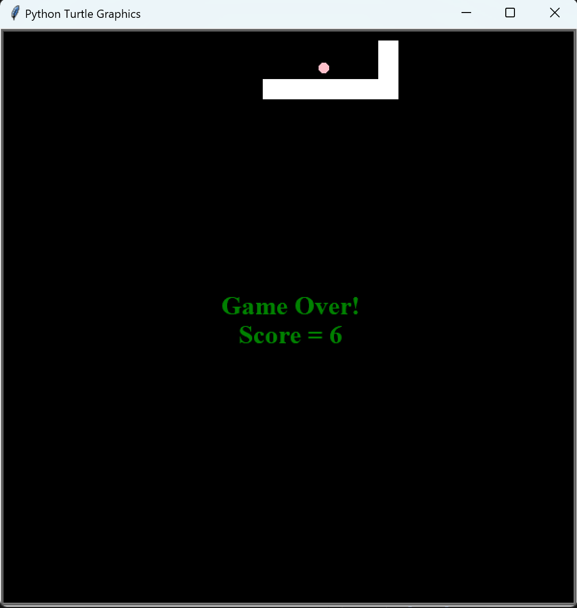
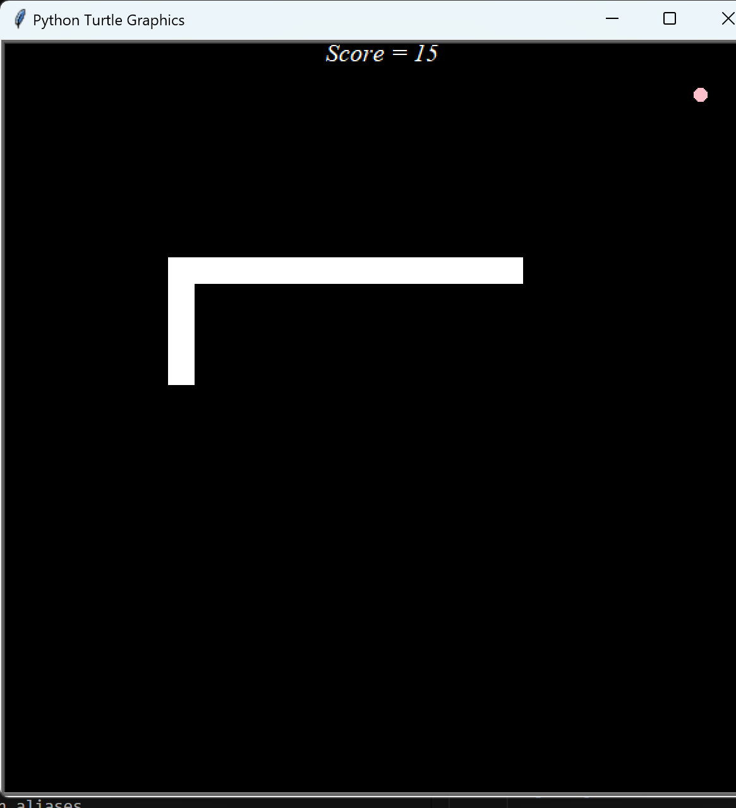

# 🐍 Snake Game (Python Turtle Version)

A classic snake game built using Python's Turtle graphics library. The objective is simple — eat food, grow the snake, and avoid collisions!

---

## 📸 Screenshots

| Game Over Screen | Mid-Game |
|------------------|----------|
|  |  |

> Score = 6 on Game Over screen and Score = 15 during gameplay.

---

## 🧰 Technologies Used

- Python 3.x
- Turtle Graphics (built-in Python module)

---

## 🎮 How to Play

- Use the **Arrow Keys** to move the snake.
- Eat the **pink dot (food)** to grow and increase your score.
- Don’t run into the walls or yourself — or it’s **Game Over**.
- Your final score is displayed when the game ends.

---

## 🚀 How to Run the Game

1. Clone this repository:

```bash
git clone https://github.com/Abhi10jan/Snake-Game.git
cd Snake-Game
